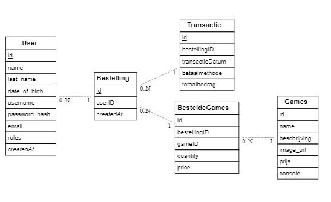
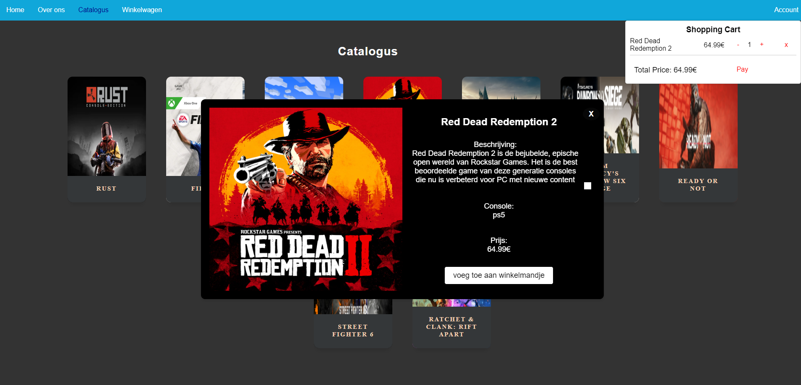
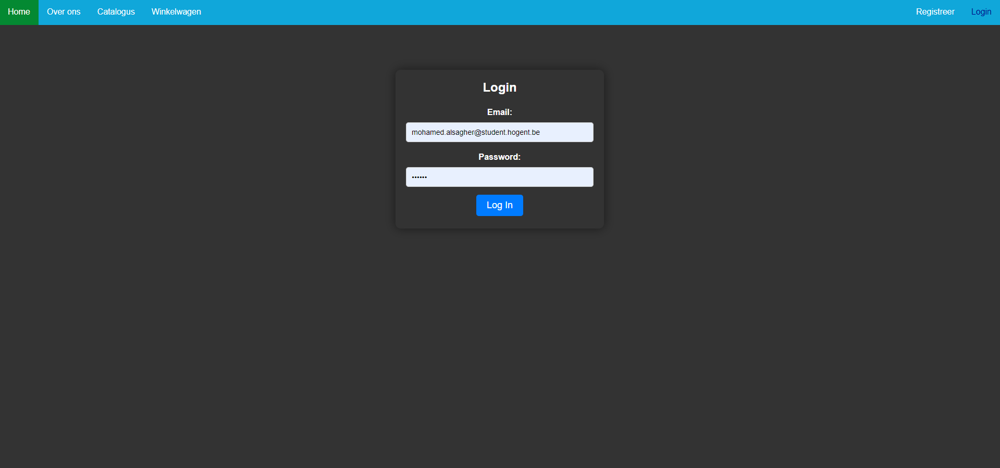
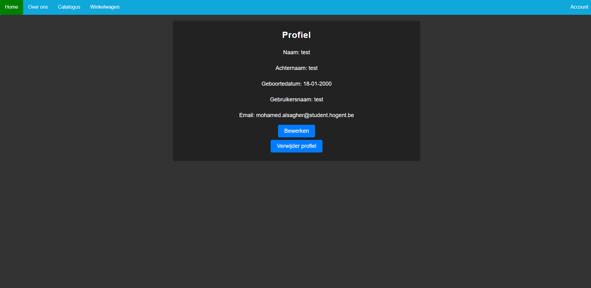
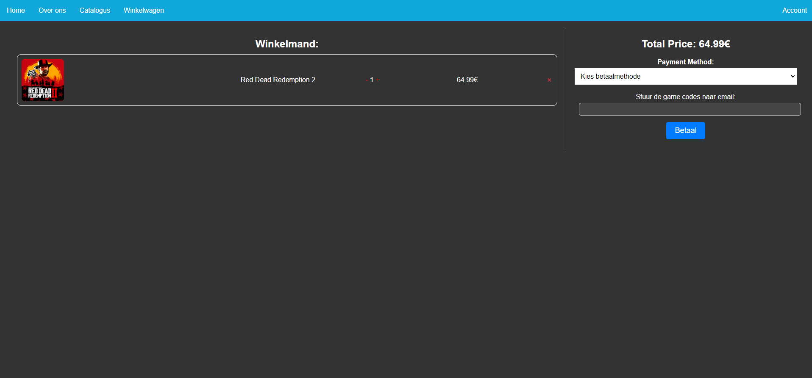
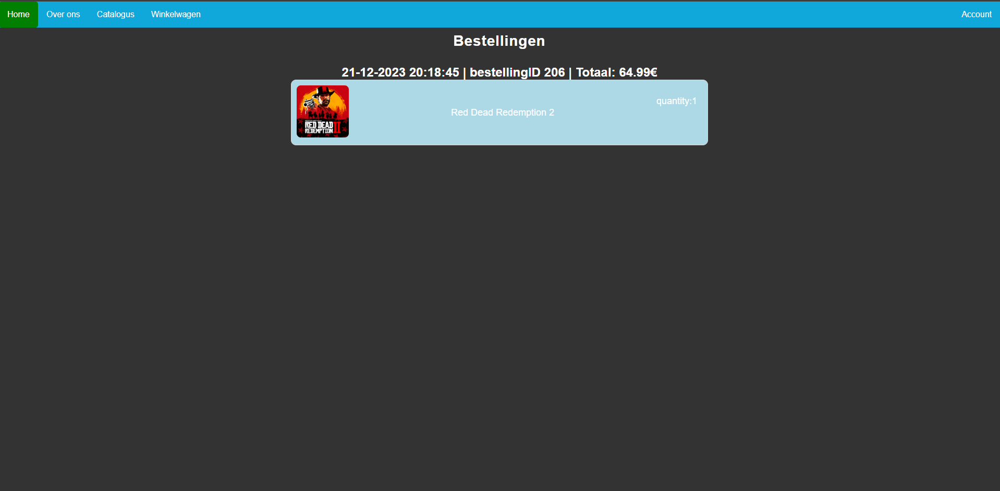
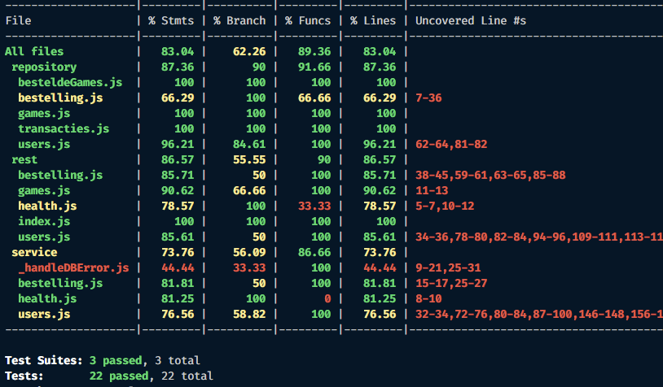

# Mohamed Alsagher (202184957)

- [x] Front-end Web Development
  - <https://github.com/Web-IV/2324-frontendweb-MohamedAlsagher.git>
  - <https://gamestart.onrender.com/>
- [x] Web Services: GITHUB URL
  - <https://github.com/Web-IV/2324-webservices-MohamedAlsagher.git>
  - <https://gamestart-api.onrender.com/>

**Logingegevens**
(verschil tussen beide accounts alleen in backend)

ADMIN:

- Gebruikersnaam/e-mailadres: user1@hotmail.com
- Wachtwoord: 12345678

  USER:

- Gebruikersnaam/e-mailadres: user2@hotmail.com
- Wachtwoord: 12345678

## Projectbeschrijving

Mijn project is een website waar je online games kunt kopen. je kunt browsen in de catalogus en games in winkelmandje steken. je kan een account aanmaken. Wanneer je ingelogd bent met u account kan je eindelijk via winkelmandje gaan 'betalen'. Nadat je de gegeven hebt ingevuld kan je betalen en wordt je terug naar hoofdmenu gestuurd. Daarna kan je naar u profiel gaan om u eigen gegevens te bekijken, aanpassen of zelfs u account te verwijderen. Je hebt ook een pagine bestellingen waar je jou bestel geschiedenis kunt bekijken.

## Screenshots

## API calls

<https://gamestart-api.onrender.com/swagger/>

## Behaalde minimumvereisten

### Front-end Web Development

- **componenten**

  - [x] heeft meerdere componenten - dom & slim (naast login/register)
  - [x] applicatie is voldoende complex
  - [x] definieert constanten (variabelen, functies en componenten) buiten de component
  - [x] minstens één form met meerdere velden met validatie (naast login/register)
  - [x] login systeem
         

- **routing**

  - [x] heeft minstens 2 pagina's (naast login/register)
  - [x] routes worden afgeschermd met authenticatie en autorisatie
         

- **state-management**

  - [x] meerdere API calls (naast login/register)
  - [x] degelijke foutmeldingen indien API-call faalt
  - [x] gebruikt useState enkel voor lokale state
  - [x] gebruikt gepast state management voor globale state - indien van toepassing
         

- **hooks**

  - [x] gebruikt de hooks op de juiste manier
         

- **varia**

  - [x] een aantal niet-triviale e2e testen
  - [x] minstens één extra technologie
  - [x] maakt gebruik van de laatste ES-features (async/await, object destructuring, spread operator...)
  - [x] duidelijke en volledige README.md
  - [x] volledig en tijdig ingediend dossier en voldoende commits

### Web Services

- **datalaag**

  - [x] voldoende complex (meer dan één tabel, 2 een-op-veel of veel-op-veel relaties)
  - [x] één module beheert de connectie + connectie wordt gesloten bij sluiten server
  - [x] heeft migraties - indien van toepassing
  - [x] heeft seeds
         

- **repositorylaag**

  - [x] definieert één repository per entiteit (niet voor tussentabellen) - indien van toepassing
  - [x] mapt OO-rijke data naar relationele tabellen en vice versa - indien van toepassing
         

- **servicelaag met een zekere complexiteit**

  - [x] bevat alle domeinlogica
  - [x] bevat geen SQL-queries of databank-gerelateerde code
         

- **REST-laag**

  - [x] meerdere routes met invoervalidatie
  - [x] degelijke foutboodschappen
  - [x] volgt de conventies van een RESTful API
  - [x] bevat geen domeinlogica
  - [x] geen API calls voor entiteiten die geen zin hebben zonder hun ouder (bvb tussentabellen)
  - [x] degelijke authorisatie/authenticatie op alle routes
         

- **algemeen**

  - [x] er is een minimum aan logging voorzien
  - [x] een aantal niet-triviale integratietesten (min. 1 controller >=80% coverage)
  - [x] minstens één extra technologie
  - [x] maakt gebruik van de laatste ES-features (async/await, object destructuring, spread operator...)
  - [x] duidelijke en volledige README.md
  - [x] volledig en tijdig ingediend dossier en voldoende commits

## Projectstructuur

### Front-end Web Development

Ik heb de applicatie gestructureerd om het leesbaar te maken en files makkelijk terug te vinden. Ik heb componenten die van hetzelfde "thema" zijn bij elkaar gegroepeerd in een map. bv. map voor css files, map for contextApi, map voor componenten,... Er is niet echt een hiërarchie van componenten want dit vond ik niet zo belangrijk terwijl ik aan met project werkte.

### Web Services

Ik heb de applicatie gestructureerd om het leesbaar te maken en files makkelijk terug te vinden. Ze zijn nogmaals gegroepeerd. bv. alle files voor service laag in map, zelfde voor rest laag en repository laag. Ik maak geen gebruikt van hiërarchie in mijn project want ik vind dit niet zo belangrijk.

## Extra technologie

### Front-end Web Development

ik gebruik React-query als extra technologie. React-query zorgt ervoor dat asynchrone gegevensbeheer vereenvoudigd met behulp van hooks zoals 'useQuery' en 'mutation'.  Link naar package: <https://www.npmjs.com/package/react-query/>

### Web Services

als extra functionaliteit heb ik Swagger genomen. Swagger is een tool waarmee je u API documentatie kunt schrijven. Door swagger kan de user online de api's eens testen. Link naar package: <https://www.npmjs.com/package/koa2-swagger-ui/>

## Testresultaten

### Front-end Web Development

#### Bestellingen geschiedenis test

- Bestellingen - Geen bestellingen: 
  Beschrijving: Test of de juiste boodschap wordt weergegeven wanneer er geen bestellingen zijn voor de ingelogde gebruiker.
   

- Bestellingen: (2 testen) 
  Beschrijving: Test van de basisfunctionaliteit van het tonen van bestellingen en het controleren van de redirect naar de details van een game vanuit een bestelling.

#### Registreer test

- Succesvolle registratie: 
  Beschrijving: Test of een nieuwe gebruiker met geldige gegevens succesvol kan registreren.
   

- Fout bij registratie: (8 testen) 
  beschrijving: test voor error handeling van foute input.

#### Catalogus test

- Games worden getoond: 
  Beschrijving: Test of de games worden weergegeven op de cataloguspagina.
   

- Filterspellen op console: 
  Beschrijving: Test of de games correct worden gefilterd op basis van de geselecteerde console.
   

- Games worden toegevoegd aan winkelmandje: 
  Beschrijving: Test of het toevoegen van een game aan het winkelmandje correct werkt.
   

- Games-popup kan worden gesloten: 
  Beschrijving: Test of de games-popup kan worden geopend en gesloten.

#### Login test

- Succesvol inloggen: 
  Beschrijving: Controleer of een gebruiker succesvol kan inloggen met geldige input.
   

- Foutmelding bij gefaalde login: 
  Beschrijving: Controleer of een foutmelding wordt weergegeven bij een inlogpoging met ongeldige input.

#### Winkelmandje test

- Hoeveelheid games verhogen: 
  Beschrijving: Controleer of het verhogen van de hoeveelheid games in het winkelmandje correct werkt.
   

- Hoeveelheid games verlagen: 
  Beschrijving: Controleer of het verlagen van de hoeveelheid games in het winkelmandje correct werkt.
   

- Verwijder game uit mandje: 
  Beschrijving: Controleer of het verwijderen van een game uit het winkelmandje correct werkt.
   
- Redirect naar login wanneer niet ingelogd: 
  Beschrijving: Controleer of de gebruiker wordt omgeleid naar de inlogpagina wanneer deze probeert af te rekenen zonder ingelogd te zijn.

#### Home pagina test

- Verander naar catalogus: 
  Beschrijving: Controleer of de gebruiker succesvol naar de cataloguspagina wordt genavigeerd wanneer er op de catalogusknop wordt geklikt.

### Web Services

#### Users test

- GET /api/users (user role): 
  Beschrijving: Test of een gebruiker zijn eigen gegevens kan ophalen met de juiste authenticatie.
   
- GET /api/users (admin role): 
  Beschrijving: Test of een admin alle gebruikersgegevens kan ophalen met de juiste authenticatie.
   
- GET /api/users/:id (user role): 
  Beschrijving: Test of een gebruiker geen toegang heeft tot de gegevens van een andere gebruiker.
   
- GET /api/users/:id (admin role): 
  Beschrijving: Test of een admin toegang heeft tot de gegevens van een specifieke gebruiker.
   
- POST /api/users/register: 
  Beschrijving: Test of het registreren van een nieuwe gebruiker correct werkt met de juiste invoer.
   
- POST /api/users/register (duplicaat e-mail): 
  Beschrijving: Test of het registreren met een bestaand e-mailadres een fout oplevert.
   
- PUT /api/users/:id (user role - mislukt): 
  Beschrijving: Test of een gebruiker zijn eigen gegevens niet kan bijwerken.
   
- PUT /api/users (user role): 
  Beschrijving: Test of een gebruiker zijn eigen gegevens kan bijwerken met de juiste authenticatie.
   
- PUT /api/users (user role - ongeldige e-mail): 
  Beschrijving: Test of het bijwerken met een ongeldige e-mail een fout oplevert.
   
- PUT /api/users/:id (admin role): 
  Beschrijving: Test of een admin de gegevens van een gebruiker kan bijwerken.
   
- DELETE /api/users (user role): 
  Beschrijving: Test of een gebruiker zijn eigen account kan verwijderen met de juiste authenticatie.
   
- DELETE /api/users/:id (user role - mislukt): 
  Beschrijving: Test of een gebruiker zijn eigen account niet kan verwijderen met onjuiste authenticatie.
   
- DELETE /api/users/:id (admin role): 
  Beschrijving: Test of een admin het account van een gebruiker kan verwijderen.

#### Bestelling test

- GET /api/bestelling (user role): 
  Beschrijving: Test of een gebruiker alle bestellingen kan ophalen met de juiste authenticatie.
   
- GET /api/bestelling/:id (user role): 
  Beschrijving: Test of een gebruiker geen toegang heeft tot specifieke bestellingen met de juiste authenticatie.
   
- GET /api/bestelling/:id (admin role): 
  Beschrijving: Test of een admin toegang heeft tot specifieke bestellingen met de juiste authenticatie.
   
- POST /api/bestelling: 
  Beschrijving: Test of het aanmaken van een nieuwe bestelling correct werkt met de juiste invoer.

#### Games test

- GET /api/games: 
  Beschrijving: Test of het ophalen van de lijst met games correct werkt.

## Gekende bugs

### Front-end Web Development

- Bij het bijwerken van profiel werkt error handling. Behalve voor "email bestaat al". Voor één of ander reden wordt de fail gezien als een succes en toont geen foutmelding. Mijn code zegt juist dat het wel error handling moet tonen. Dit is nieuwe bug want vroeger werkte het wel.
   
- wanneer ingelogd met een user die rol ADMIN heeft, toon het niet de profiel gegevens wanneer je naar profiel gaat. Als je ingelogd bent met rol user dan zie je u eigen gegevens wel bij profiel 
- Bij het runnen van de test met google gebeurt het soms dan maar 2 testen per file runnen en de andere testen hebben een error 'no commands were issued in this test'. Wanneer je het erna bij een andere browser probeert dan werken alle testen.

### Web Services

- Wanneer je yarn test runt of yarn test:coverage dan is er een bug wanneer je voor het eerst runt dat het faalt omdat het eerst users test uitvoert en erna bestellingen test. (hier gebeurt dan iets mis). Wanneer je de test voor een tweede keer runt dan test het eerst bestellingen en erna users en dan werken alle testen zoals het moet en slagen ze. 

### Front-end Web Development

- Dit en dat

### Web Services

- Oh en dit ook
